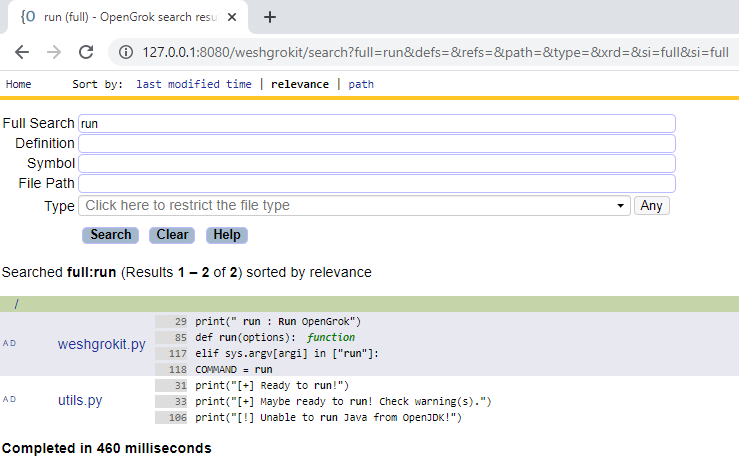

# weshgrokit

 

Weshgrokit a tool inspired by the no more maintained [Grokit](https://github.com/raghusesha/grokit) project.
Like Grokit, you can deploy an Opengrok but only with 3 commands and from scratch.
Even Java is not needed to be installed first

Install, index and run!

### Usage

    Usage: weshgrokit.py [command]

    Command:
        help       : Show help
        install    : Download and install required files for running OpenGrok
        index      : Index/Update the source directory
        run        : Run OpenGrok
    
    Options:
        -source, -s: Set source directory to index

## Details

- It will download Windows x64 binaries only
- Tomcat version: 9.0.37
- Opengrok version: 1.3.16
- OpenJDK version: 14.0.2
- Downloaded files in ./downloaded
- Installed/extracted files in ./installed
- Index data in ./data

## Examples

- Install

    
      python weshgrokit.py install
      Starting weshgrokit.py at Mon Aug  7 21:15:57 2020 (64bit version)
    
      [+] Downloading openjdk-14.0.2_windows-x64_bin.zip
          [**************************************************]
      [+] Downloading apache-tomcat-9.0.37-windows-x64.zip
          [**************************************************]
      [+] Downloading opengrok-1.3.16.tar.gz
          [**************************************************]
      [+] Downloading ctags-2020-07-22_631690ad-x64.zip
          [**************************************************]
      [+] Extracting downloads\openjdk-14.0.2_windows-x64_bin.zip
      [+] Extracting downloads\apache-tomcat-9.0.37-windows-x64.zip
      [+] Extracting downloads\opengrok-1.3.16.tar.gz
      [+] Extracting downloads\ctags-2020-07-22_631690ad-x64.zip
      [+] Extracting installed\opengrok-1.3.16\lib\source.war
      [+] Ready to index the source directory!

- Index

      python weshgrokit.py index -s d:\test
      Starting weshgrokit.py at Mon Aug  7 21:18:47 2020 (64bit version)
    
      [+] Indexing: d:\test
      [+] Done
      [+] Ready to run!

- Run

      D:\Repos\weshgrokit>python weshgrokit.py run
      Starting weshgrokit.py at Mon Aug  3 21:18:54 2020 (64bit version)
    
      [+] Running Tomcat server ...
      [+] Check on http://localhost:8080/weshgrokit/

## Screenshots

  

